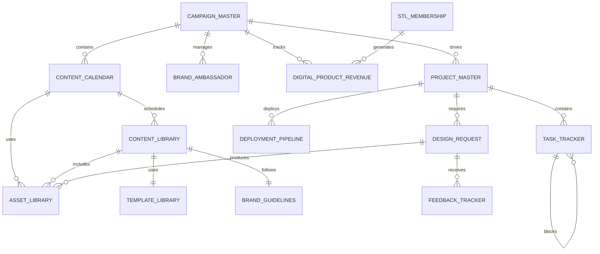

# Notion Database Relationships & Implementation Architecture

**Version**: 1.0 - Detailed Technical Implementation  
**Status**: 🏗️ IMPLEMENTATION READY  
**Framework**: Apple Intelligence Strategic Director Enhanced

---

## Database Relationship Map

### Master Relationship Diagram



---

## Implementation Scripts

### 1. Database Creation Script

```javascript
// notion-setup-datasources.js
const { Client } = require('@notionhq/client');
const dotenv = require('dotenv');
dotenv.config({ path: '/Users/pennyplatt/9BitStudios/Oksana-creatrix-portal/.env.local' });

const notion = new Client({ auth: process.env.NOTION_API_KEY });

// Database creation functions
async function createCampaignMasterDatabase(parentPageId) {
  const database = await notion.datasources.create({
    parent: { page_id: parentPageId },
    title: [{ text: { content: "📢 Campaign Master" } }],
    icon: { emoji: "📢" },
    properties: {
      "Name": { title: {} },
      "Status": {
        select: {
          options: [
            { name: "Planning", color: "gray" },
            { name: "Active", color: "green" },
            { name: "Paused", color: "yellow" },
            { name: "Completed", color: "blue" }
          ]
        }
      },
      "Priority": {
        select: {
          options: [
            { name: "High", color: "red" },
            { name: "Medium", color: "orange" },
            { name: "Low", color: "gray" }
          ]
        }
      },
      "Platforms": {
        multi_select: {
          options: [
            { name: "Twitter/X", color: "blue" },
            { name: "Facebook", color: "blue" },
            { name: "Instagram", color: "purple" },
            { name: "YouTube", color: "red" },
            { name: "TikTok", color: "pink" },
            { name: "Discord", color: "purple" }
          ]
        }
      },
      "Start Date": { date: {} },
      "End Date": { date: {} },
      "Budget": { number: { format: "dollar" } },
      "Objectives": { rich_text: {} },
      "Target Audience": { multi_select: {} },
      "Reach": { number: { format: "number" } },
      "Engagement": { number: { format: "percent" } },
      "Conversions": { number: { format: "number" } },
      "ROI": { number: { format: "percent" } },
      "Content Items": { relation: { database_id: null, single_property: false } },
      "Tasks": { relation: { database_id: null, single_property: false } },
      "Brand Assets": { relation: { database_id: null, single_property: false } },
      "AI Score": { number: { format: "number" } },
      "AI Insights": { rich_text: {} }
    }
  });
  
  console.log(`✅ Created Campaign Master database: ${database.id}`);
  return database.id;
}

async function createContentLibraryDatabase(parentPageId) {
  const database = await notion.datasources.create({
    parent: { page_id: parentPageId },
    title: [{ text: { content: "📝 Content Library" } }],
    icon: { emoji: "📝" },
    properties: {
      "Title": { title: {} },
      "Type": {
        select: {
          options: [
            { name: "Website Copy", color: "blue" },
            { name: "Blog Post", color: "green" },
            { name: "Email", color: "orange" },
            { name: "Social Media", color: "purple" },
            { name: "Product Description", color: "pink" }
          ]
        }
      },
      "Status": {
        select: {
          options: [
            { name: "Draft", color: "gray" },
            { name: "Review", color: "yellow" },
            { name: "Approved", color: "green" },
            { name: "Published", color: "blue" },
            { name: "Archived", color: "brown" }
          ]
        }
      },
      "Content": { rich_text: {} },
      "Word Count": { number: { format: "number" } },
      "Reading Time": { number: { format: "number" } },
      "Language": { select: { options: [{ name: "English", color: "blue" }] } },
      "Tone": {
        select: {
          options: [
            { name: "Professional", color: "blue" },
            { name: "Casual", color: "green" },
            { name: "Technical", color: "gray" },
            { name: "Marketing", color: "orange" },
            { name: "Educational", color: "purple" }
          ]
        }
      },
      "SEO Title": { rich_text: {} },
      "SEO Description": { rich_text: {} },
      "Keywords": { multi_select: {} },
      "Slug": { rich_text: {} },
      "Quality Score": { number: { format: "number" } },
      "Brand Alignment": { number: { format: "percent" } },
      "Readability Score": { number: { format: "number" } },
      "SEO Score": { number: { format: "number" } },
      "AI Improvements": { rich_text: {} },
      "Views": { number: { format: "number" } },
      "Engagement Rate": { number: { format: "percent" } },
      "Conversion Rate": { number: { format: "percent" } },
      "Campaign": { relation: { database_id: null, single_property: false } },
      "Assets": { relation: { database_id: null, single_property: false } },
      "Template": { relation: { database_id: null, single_property: true } }
    }
  });
  
  console.log(`✅ Created Content Library database: ${database.id}`);
  return database.id;
}

async function createProjectMasterDatabase(parentPageId) {
  const database = await notion.datasources.create({
    parent: { page_id: parentPageId },
    title: [{ text: { content: "💻 Project Master" } }],
    icon: { emoji: "💻" },
    properties: {
      "Project Name": { title: {} },
      "Type": {
        select: {
          options: [
            { name: "Shopify Theme", color: "green" },
            { name: "Vercel App", color: "black" },
            { name: "Web Design", color: "blue" },
            { name: "Integration", color: "purple" }
          ]
        }
      },
      "Status": {
        select: {
          options: [
            { name: "Planning", color: "gray" },
            { name: "Development", color: "blue" },
            { name: "Testing", color: "yellow" },
            { name: "Staging", color: "orange" },
            { name: "Production", color: "green" }
          ]
        }
      },
      "Priority": {
        select: {
          options: [
            { name: "Critical", color: "red" },
            { name: "High", color: "orange" },
            { name: "Medium", color: "yellow" },
            { name: "Low", color: "gray" }
          ]
        }
      },
      "Frontend Stack": { multi_select: {} },
      "Backend Stack": { multi_select: {} },
      "Database": { multi_select: {} },
      "Hosting": { multi_select: {} },
      "Start Date": { date: {} },
      "Target Date": { date: {} },
      "Actual Date": { date: {} },
      "Lead": { people: {} },
      "Developers": { people: {} },
      "Designers": { people: {} },
      "QA": { people: {} },
      "Tasks": { relation: { database_id: null, single_property: false } },
      "Campaigns": { relation: { database_id: null, single_property: false } },
      "Assets": { relation: { database_id: null, single_property: false } }
    }
  });
  
  console.log(`✅ Created Project Master database: ${database.id}`);
  return database.id;
}

// Additional database creation functions...
// (Continuing with all other datasources from the implementation plan)

// Main setup function
async function setupNotionPortal() {
  try {
    console.log("🚀 Starting Oksana Creator Portal Accelerator setup...");
    
    // Get or create parent pages
    const petersenGamesPageId = process.env.PETERSEN_GAMES_PAGE_ID;
    const nineBitStudiosPageId = process.env.NINEBIT_STUDIOS_PAGE_ID;
    
    // Create Petersen Games datasources
    console.log("📢 Setting up Petersen Games Hub...");
    const campaignMasterId = await createCampaignMasterDatabase(petersenGamesPageId);
    const contentLibraryId = await createContentLibraryDatabase(petersenGamesPageId);
    const projectMasterId = await createProjectMasterDatabase(petersenGamesPageId);
    // ... create other datasources
    
    // Update relations
    console.log("🔗 Updating database relations...");
    await updateDatabaseRelations({
      campaignMasterId,
      contentLibraryId,
      projectMasterId,
      // ... other database IDs
    });
    
    // Create views
    console.log("👁️ Creating database views...");
    await createDatabaseViews();
    
    // Setup automations
    console.log("⚡ Setting up automations...");
    await setupAutomations();
    
    console.log("✅ Oksana Creator Portal Accelerator setup complete!");
    
  } catch (error) {
    console.error("❌ Setup failed:", error);
    process.exit(1);
  }
}

// Run setup
setupNotionPortal();
```

### 2. Automation Setup Script

```javascript
// notion-setup-automations.js
const { NotionAutomation } = require('./lib/notion-automation');

async function setupContentPublishingAutomation() {
  const automation = new NotionAutomation({
    name: "Content Publishing Workflow",
    trigger: {
      type: "property_changed",
      database: "Content Library",
      property: "Status",
      from: "Review",
      to: "Approved"
    },
    actions: [
      {
        type: "run_ai_analysis",
        config: {
          analysisType: "final_quality_check",
          minimumScore: 0.85,
          failureAction: "notify_and_hold"
        }
      },
      {
        type: "schedule_publishing",
        config: {
          timing: "calculate_optimal_time",
          platforms: "get_from_campaign",
          crossPost: true
        }
      },
      {
        type: "create_notification",
        config: {
          recipients: ["content_team", "campaign_owner"],
          message: "Content approved and scheduled for publishing",
          includeDetails: true
        }
      },
      {
        type: "create_followup_task",
        config: {
          title: "Monitor content performance",
          assignTo: "content_owner",
          dueDate: "1_day_after_publish",
          template: "performance_monitoring_template"
        }
      }
    ]
  });
  
  await automation.deploy();
  console.log("✅ Content Publishing automation deployed");
}

async function setupDesignRequestAutomation() {
  const automation = new NotionAutomation({
    name: "Design Request Processing",
    trigger: {
      type: "new_item",
      database: "Design Requests"
    },
    actions: [
      {
        type: "analyze_brief",
        config: {
          useAppleIntelligence: true,
          extractRequirements: true,
          estimateComplexity: true,
          suggestApproach: true
        }
      },
      {
        type: "auto_assign",
        config: {
          strategy: "workload_balanced",
          considerSkills: true,
          notifyAssignee: true
        }
      },
      {
        type: "create_project_structure",
        config: {
          template: "design_project_template",
          createSubtasks: true,
          linkToRequest: true
        }
      }
    ]
  });
  
  await automation.deploy();
  console.log("✅ Design Request automation deployed");
}

// Campaign Performance Monitoring
async function setupCampaignMonitoring() {
  const automation = new NotionAutomation({
    name: "Campaign Performance Monitor",
    trigger: {
      type: "scheduled",
      frequency: "daily",
      time: "09:00"
    },
    actions: [
      {
        type: "fetch_analytics",
        config: {
          platforms: ["twitter", "facebook", "instagram", "youtube"],
          metrics: ["reach", "engagement", "conversions"],
          period: "last_24_hours"
        }
      },
      {
        type: "update_campaign_metrics",
        config: {
          calculateROI: true,
          updateTrends: true,
          flagAnomalies: true
        }
      },
      {
        type: "generate_insights",
        config: {
          useGridAnalytics: true,
          compareToObjectives: true,
          suggestOptimizations: true
        }
      },
      {
        type: "send_report",
        config: {
          recipients: ["campaign_managers", "stakeholders"],
          format: "executive_summary",
          includeRecommendations: true
        }
      }
    ]
  });
  
  await automation.deploy();
  console.log("✅ Campaign Monitoring automation deployed");
}

// Main automation setup
async function setupAllAutomations() {
  console.log("⚡ Setting up Notion automations...");
  
  await setupContentPublishingAutomation();
  await setupDesignRequestAutomation();
  await setupCampaignMonitoring();
  // ... setup other automations
  
  console.log("✅ All automations deployed successfully");
}

module.exports = { setupAllAutomations };
```

### 3. View Configuration Script

```javascript
// notion-setup-views.js
const { NotionViewBuilder } = require('./lib/notion-view-builder');

async function setupCampaignViews(databaseId) {
  const viewBuilder = new NotionViewBuilder(databaseId);
  
  // Active Campaigns Board
  await viewBuilder.createView({
    name: "🎯 Active Campaigns",
    type: "board",
    config: {
      groupBy: "Status",
      filter: {
        and: [
          { property: "Status", select: { equals: "Active" } }
        ]
      },
      sort: [
        { property: "Priority", direction: "descending" },
        { property: "End Date", direction: "ascending" }
      ],
      visibleProperties: [
        "Platforms",
        "Budget",
        "ROI",
        "End Date",
        "AI Score"
      ]
    }
  });
  
  // Content Calendar View
  await viewBuilder.createView({
    name: "📅 Content Calendar",
    type: "calendar",
    config: {
      dateProperty: "Publish Date",
      showProperties: ["Title", "Platform", "Status", "AI Score"],
      colorBy: "Platform"
    }
  });
  
  // Performance Dashboard
  await viewBuilder.createView({
    name: "📊 Performance Dashboard",
    type: "gallery",
    config: {
      cardSize: "large",
      coverProperty: "Campaign Visual",
      properties: [
        "ROI",
        "Reach",
        "Engagement",
        "Conversions",
        "Budget Spent"
      ],
      filter: {
        or: [
          { property: "Status", select: { equals: "Active" } },
          { property: "Status", select: { equals: "Completed" } }
        ]
      }
    }
  });
  
  console.log("✅ Campaign views created");
}

async function setupDevelopmentViews(databaseId) {
  const viewBuilder = new NotionViewBuilder(databaseId);
  
  // Sprint Board
  await viewBuilder.createView({
    name: "🏃 Sprint Board",
    type: "board",
    config: {
      groupBy: "Status",
      cardPreview: {
        size: "medium",
        showProperties: ["Assignee", "Due Date", "Priority", "Estimated Hours"]
      },
      sort: [{ property: "Priority", direction: "descending" }]
    }
  });
  
  // Timeline View
  await viewBuilder.createView({
    name: "📈 Project Timeline",
    type: "timeline",
    config: {
      dateRange: {
        start: "Start Date",
        end: "Target Date"
      },
      groupBy: "Project Type",
      showDependencies: true,
      colorBy: "Status"
    }
  });
  
  // Team Workload
  await viewBuilder.createView({
    name: "👥 Team Workload",
    type: "table",
    config: {
      groupBy: "Assignee",
      aggregations: {
        "Estimated Hours": "sum",
        "Tasks": "count",
        "Overdue": "count_if(Status != 'Done' AND Due Date < today())"
      },
      properties: [
        "Title",
        "Project",
        "Status",
        "Due Date",
        "Estimated Hours"
      ]
    }
  });
  
  console.log("✅ Development views created");
}

// Main view setup
async function setupAllViews(databaseIds) {
  console.log("👁️ Setting up database views...");
  
  await setupCampaignViews(databaseIds.campaignMaster);
  await setupDevelopmentViews(databaseIds.projectMaster);
  // ... setup other views
  
  console.log("✅ All views configured successfully");
}

module.exports = { setupAllViews };
```

### 4. Integration Configuration

```javascript
// notion-integration-config.js
module.exports = {
  // Apple Intelligence Integration
  appleIntelligence: {
    endpoints: {
      contentAnalysis: "/api/apple-intelligence/analyze",
      brandValidation: "/api/apple-intelligence/validate-brand",
      qualityScoring: "/api/apple-intelligence/score-quality",
      suggestions: "/api/apple-intelligence/suggest-improvements"
    },
    config: {
      useNeuralEngine: true,
      privacyLevel: "high",
      processingMode: "realtime"
    }
  },
  
  // Grid Analytics Integration  
  gridAnalytics: {
    endpoints: {
      metrics: "/api/grid/calculate-metrics",
      roi: "/api/grid/roi-analysis",
      predictions: "/api/grid/predict",
      optimization: "/api/grid/optimize"
    },
    config: {
      refreshInterval: 3600, // 1 hour
      cacheResults: true,
      batchRequests: true
    }
  },
  
  // Platform Integrations
  platforms: {
    shopify: {
      baseUrl: process.env.SHOPIFY_API_URL,
      version: "2024-01",
      resources: ["products", "orders", "customers", "analytics"]
    },
    klaviyo: {
      baseUrl: process.env.KLAVIYO_API_URL,
      version: "v3",
      resources: ["campaigns", "lists", "metrics", "templates"]
    },
    social: {
      twitter: {
        apiVersion: "2",
        endpoints: ["tweets", "users", "analytics"]
      },
      facebook: {
        apiVersion: "v18.0",
        endpoints: ["posts", "insights", "pages"]
      },
      instagram: {
        apiVersion: "v18.0",
        endpoints: ["media", "insights", "stories"]
      }
    }
  },
  
  // Webhook Configuration
  webhooks: {
    notion: {
      endpoint: "/webhooks/notion",
      events: ["page_updated", "database_updated", "comment_added"]
    },
    shopify: {
      endpoint: "/webhooks/shopify",
      events: ["order_created", "product_updated", "customer_created"]
    }
  }
};
```

---

## Implementation Checklist

### Pre-Implementation
- [ ] Verify Notion API access and permissions
- [ ] Confirm environment variables are set
- [ ] Review database schemas with stakeholders
- [ ] Plan data migration strategy if needed

### Database Creation
- [ ] Create Petersen Games workspace/page
- [ ] Create 9Bit Studios workspace/page  
- [ ] Run database creation scripts
- [ ] Verify all properties are created correctly
- [ ] Set up database relations

### View Configuration
- [ ] Create board views for task management
- [ ] Set up calendar views for content
- [ ] Configure gallery views for campaigns
- [ ] Create timeline views for projects
- [ ] Set up filtered views for teams

### Automation Deployment
- [ ] Deploy content publishing workflow
- [ ] Set up design request automation
- [ ] Configure campaign monitoring
- [ ] Test all automation triggers
- [ ] Verify notification delivery

### Integration Testing
- [ ] Test Apple Intelligence connections
- [ ] Verify Grid Analytics data flow
- [ ] Confirm platform API integrations
- [ ] Test webhook functionality
- [ ] Validate data synchronization

### User Setup
- [ ] Create user groups and permissions
- [ ] Deploy user guides and documentation
- [ ] Conduct training sessions
- [ ] Set up support channels
- [ ] Gather initial feedback

---

**Status**: 🚀 READY FOR IMPLEMENTATION  
**Next Steps**: Run database creation scripts in sequence  
**Support**: Comprehensive error handling and logging included