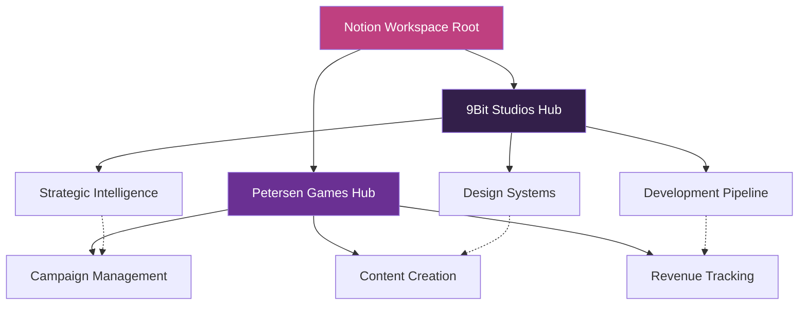

# Notion Intelligent Portal Implementation Plan
## Comprehensive Architecture & Database Schema Design

**Version**: 3.0 - Apple Intelligence Strategic Director Enhanced  
**Status**: 🚀 READY FOR IMPLEMENTATION  
**Authority**: Sources-of-Truth Validated  
**Integration**: Apple Intelligence + Grid Analytics + M4 Neural Engine

---

## 1. Workspace Architecture

### Overall Structure
```
NOTION WORKSPACE ROOT
├── 🏢 9BIT STUDIOS HUB (Parent Workspace)
│   ├── 📊 Strategic Command Center
│   ├── 🎨 Design System Intelligence Hub
│   ├── 🚀 Product Pipeline Dashboard
│   ├── 📈 Grid Analytics Center
│   └── 🤖 Apple Intelligence Monitor
│
└── 🎮 PETERSEN GAMES HUB (Linked Workspace)
    ├── 📢 Campaign Command Center
    ├── 💻 Development Tracker
    ├── 📝 Content Intelligence System
    ├── 🎨 Design Request Portal
    └── 📊 Revenue Analytics Dashboard
```

### Hub Relationships


---

## 2. Petersen Games Campaign Dashboard

### Database Schema: Campaign Master

```typescript
interface CampaignMaster {
  // Core Properties
  id: string;                          // Unique campaign ID
  name: string;                        // Campaign name
  status: 'Planning' | 'Active' | 'Paused' | 'Completed';
  priority: 'High' | 'Medium' | 'Low';
  
  // Platform Configuration
  platforms: {
    twitter: { enabled: boolean; handle: string; };
    facebook: { enabled: boolean; pageId: string; };
    instagram: { enabled: boolean; username: string; };
    youtube: { enabled: boolean; channelId: string; };
    tiktok: { enabled: boolean; username: string; };
    discord: { enabled: boolean; serverId: string; };
  };
  
  // Campaign Details
  startDate: Date;
  endDate: Date;
  budget: number;
  objectives: string[];
  targetAudience: string[];
  
  // Performance Tracking
  metrics: {
    reach: number;
    engagement: number;
    conversions: number;
    roi: number;
  };
  
  // Relations
  contentItems: Relation<ContentLibrary>;
  tasks: Relation<TaskTracker>;
  brandAssets: Relation<AssetLibrary>;
}
```

### Database Schema: Content Calendar

```typescript
interface ContentCalendar {
  // Scheduling
  id: string;
  publishDate: DateTime;
  platforms: string[];
  status: 'Draft' | 'Scheduled' | 'Published' | 'Archived';
  
  // Content Details
  contentType: 'Post' | 'Story' | 'Video' | 'Live' | 'Article';
  title: string;
  description: string;
  hashtags: string[];
  
  // Apple Intelligence Enhancement
  aiScore: number;                     // Quality score from Apple Intelligence
  brandAlignment: number;              // Brand consistency score
  suggestions: string[];               // AI improvement suggestions
  
  // Relations
  campaign: Relation<CampaignMaster>;
  assets: Relation<AssetLibrary>;
  analytics: Relation<AnalyticsTracker>;
}
```

### Database Schema: STL Membership Planning

```typescript
interface STLMembershipPlanning {
  // Member Management
  id: string;
  tier: 'Bronze' | 'Silver' | 'Gold' | 'Platinum';
  memberCount: number;
  monthlyRevenue: number;
  
  // Benefits Planning
  benefits: {
    earlyAccess: boolean;
    exclusiveModels: string[];
    discountPercentage: number;
    specialEvents: boolean;
  };
  
  // Content Strategy
  contentPlan: {
    monthlyReleases: number;
    exclusiveContent: string[];
    communityFeatures: string[];
  };
  
  // Growth Tracking
  growthMetrics: {
    newMembersThisMonth: number;
    churnRate: number;
    lifetimeValue: number;
    satisfactionScore: number;
  };
}
```

### Database Schema: Digital Product Revenue

```typescript
interface DigitalProductRevenue {
  // Product Information
  id: string;
  productName: string;
  productType: 'STL' | 'PDF' | 'Digital_Game' | 'Course' | 'Asset_Pack';
  platform: 'Shopify' | 'MyMiniFactory' | 'DriveThruRPG' | 'Own_Platform';
  
  // Revenue Tracking
  revenue: {
    daily: number;
    weekly: number;
    monthly: number;
    yearly: number;
  };
  
  // Performance Metrics
  metrics: {
    unitsSold: number;
    averageOrderValue: number;
    conversionRate: number;
    customerSatisfaction: number;
  };
  
  // Relations
  campaigns: Relation<CampaignMaster>;
  analytics: Relation<AnalyticsTracker>;
}
```

### Database Schema: Brand Ambassador Program

```typescript
interface BrandAmbassadorProgram {
  // Ambassador Details
  id: string;
  name: string;
  socialHandle: string;
  platform: string[];
  tier: 'Micro' | 'Mid' | 'Macro' | 'Mega';
  
  // Performance Tracking
  performance: {
    reach: number;
    engagementRate: number;
    conversions: number;
    contentCreated: number;
  };
  
  // Compensation
  compensation: {
    type: 'Commission' | 'Flat_Fee' | 'Product' | 'Hybrid';
    amount: number;
    frequency: 'Per_Post' | 'Monthly' | 'Campaign';
  };
  
  // Content Management
  content: {
    approved: string[];
    pending: string[];
    published: string[];
  };
  
  // Relations
  campaigns: Relation<CampaignMaster>;
  content: Relation<ContentLibrary>;
}
```

---

## 3. Development Tracker

### Database Schema: Project Master

```typescript
interface ProjectMaster {
  // Core Information
  id: string;
  projectName: string;
  projectType: 'Shopify_Theme' | 'Vercel_App' | 'Web_Design' | 'Integration';
  status: 'Planning' | 'Development' | 'Testing' | 'Staging' | 'Production';
  priority: 'Critical' | 'High' | 'Medium' | 'Low';
  
  // Technical Details
  techStack: {
    frontend: string[];
    backend: string[];
    database: string[];
    hosting: string[];
  };
  
  // Timeline
  timeline: {
    startDate: Date;
    targetDate: Date;
    actualDate?: Date;
    milestones: Milestone[];
  };
  
  // Team
  team: {
    lead: string;
    developers: string[];
    designers: string[];
    qa: string[];
  };
  
  // Relations
  tasks: Relation<TaskTracker>;
  campaigns: Relation<CampaignMaster>;
  assets: Relation<AssetLibrary>;
}
```

### Database Schema: Task Tracker

```typescript
interface TaskTracker {
  // Task Details
  id: string;
  title: string;
  description: string;
  type: 'Feature' | 'Bug' | 'Enhancement' | 'Documentation' | 'Testing';
  status: 'Backlog' | 'Todo' | 'In_Progress' | 'Review' | 'Done';
  
  // Assignment
  assignee: string;
  reviewer?: string;
  dueDate: Date;
  estimatedHours: number;
  actualHours?: number;
  
  // Technical Context
  technicalDetails: {
    component: string;
    dependencies: string[];
    testingRequired: boolean;
    documentationUpdated: boolean;
  };
  
  // Apple Intelligence Enhancement
  aiInsights: {
    complexityScore: number;
    suggestedApproach: string;
    potentialIssues: string[];
    optimizationTips: string[];
  };
  
  // Relations
  project: Relation<ProjectMaster>;
  blockedBy: Relation<TaskTracker>;
  blocks: Relation<TaskTracker>;
}
```

### Database Schema: Deployment Pipeline

```typescript
interface DeploymentPipeline {
  // Deployment Info
  id: string;
  environment: 'Development' | 'Staging' | 'Production';
  deploymentType: 'Manual' | 'Automated' | 'Scheduled';
  status: 'Pending' | 'In_Progress' | 'Success' | 'Failed' | 'Rolled_Back';
  
  // Version Control
  version: {
    number: string;
    gitCommit: string;
    branch: string;
    tag?: string;
  };
  
  // Deployment Details
  details: {
    deployedBy: string;
    deployedAt: DateTime;
    duration: number;
    changesIncluded: string[];
  };
  
  // Quality Gates
  qualityGates: {
    testsPass: boolean;
    codeReviewApproved: boolean;
    performanceCheck: boolean;
    securityScan: boolean;
  };
  
  // Relations
  project: Relation<ProjectMaster>;
  tasks: Relation<TaskTracker>;
}
```

---

## 4. Content Intelligence System

### Database Schema: Content Library

```typescript
interface ContentLibrary {
  // Content Identification
  id: string;
  title: string;
  type: 'Website_Copy' | 'Blog_Post' | 'Email' | 'Social_Media' | 'Product_Description';
  status: 'Draft' | 'Review' | 'Approved' | 'Published' | 'Archived';
  
  // Content Details
  content: {
    body: string;
    wordCount: number;
    readingTime: number;
    language: string;
    tone: 'Professional' | 'Casual' | 'Technical' | 'Marketing' | 'Educational';
  };
  
  // SEO & Performance
  seo: {
    metaTitle: string;
    metaDescription: string;
    keywords: string[];
    slug: string;
  };
  
  // Apple Intelligence Analysis
  aiAnalysis: {
    qualityScore: number;
    brandAlignmentScore: number;
    readabilityScore: number;
    seoScore: number;
    improvements: string[];
  };
  
  // Grid Analytics
  performance: {
    views: number;
    engagement: number;
    conversionRate: number;
    bounceRate: number;
  };
  
  // Relations
  campaign: Relation<CampaignMaster>;
  assets: Relation<AssetLibrary>;
  templates: Relation<TemplateLibrary>;
}
```

### Database Schema: Template Library

```typescript
interface TemplateLibrary {
  // Template Info
  id: string;
  name: string;
  category: 'Email' | 'Blog' | 'Social' | 'Landing_Page' | 'Product';
  version: string;
  isActive: boolean;
  
  // Template Structure
  structure: {
    sections: TemplateSection[];
    variables: TemplateVariable[];
    conditionalLogic: ConditionalRule[];
  };
  
  // Design Tokens
  design: {
    colors: ColorToken[];
    typography: TypographyToken[];
    spacing: SpacingToken[];
    components: ComponentToken[];
  };
  
  // Usage Tracking
  usage: {
    timesUsed: number;
    lastUsed: Date;
    averagePerformance: number;
    popularVariations: string[];
  };
  
  // Relations
  content: Relation<ContentLibrary>;
  brand: Relation<BrandGuidelines>;
}
```

### Database Schema: Asset Library

```typescript
interface AssetLibrary {
  // Asset Information
  id: string;
  filename: string;
  type: 'Image' | 'Video' | 'Audio' | 'Document' | '3D_Model' | 'Icon';
  format: string;
  size: number;
  
  // Metadata
  metadata: {
    dimensions?: { width: number; height: number; };
    duration?: number;
    colorSpace?: string;
    tags: string[];
  };
  
  // Storage
  storage: {
    url: string;
    thumbnailUrl?: string;
    cloudinaryId?: string;
    backupUrl?: string;
  };
  
  // M4 Neural Engine Processing
  m4Processing: {
    optimized: boolean;
    compressionRatio: number;
    qualityScore: number;
    processingTime: number;
  };
  
  // Usage Rights
  rights: {
    license: string;
    attribution?: string;
    restrictions: string[];
    expiryDate?: Date;
  };
  
  // Relations
  campaigns: Relation<CampaignMaster>;
  content: Relation<ContentLibrary>;
  projects: Relation<ProjectMaster>;
}
```

### Database Schema: Brand Guidelines

```typescript
interface BrandGuidelines {
  // Brand Identity
  id: string;
  brandName: string;
  version: string;
  lastUpdated: Date;
  
  // Visual Identity
  visual: {
    primaryColors: Color[];
    secondaryColors: Color[];
    logo: { light: string; dark: string; variations: string[]; };
    typography: { headings: Font; body: Font; special: Font[]; };
  };
  
  // Voice & Tone
  voice: {
    personality: string[];
    toneAttributes: string[];
    doList: string[];
    dontList: string[];
    examplePhrases: string[];
  };
  
  // Content Rules
  contentRules: {
    writingStyle: string;
    grammarPreferences: string[];
    vocabularyGuidelines: string[];
    formattingRules: string[];
  };
  
  // Apple Intelligence Validation
  aiValidation: {
    enabled: boolean;
    strictness: 'Low' | 'Medium' | 'High';
    customRules: ValidationRule[];
    exceptionsList: string[];
  };
  
  // Relations
  content: Relation<ContentLibrary>;
  templates: Relation<TemplateLibrary>;
  assets: Relation<AssetLibrary>;
}
```

---

## 5. Design Request System

### Database Schema: Design Request

```typescript
interface DesignRequest {
  // Request Details
  id: string;
  title: string;
  requestType: 'Web_Design' | 'Graphic_Design' | '3D_Model' | 'UI_UX' | 'Branding';
  priority: 'Urgent' | 'High' | 'Normal' | 'Low';
  status: 'Submitted' | 'In_Review' | 'Assigned' | 'In_Progress' | 'Complete';
  
  // Brief Information
  brief: {
    objective: string;
    targetAudience: string;
    requirements: string[];
    constraints: string[];
    references: string[];
  };
  
  // Timeline
  timeline: {
    submittedDate: Date;
    dueDate: Date;
    estimatedHours: number;
    actualCompletionDate?: Date;
  };
  
  // Assignment
  assignment: {
    requestedBy: string;
    assignedTo?: string;
    reviewers: string[];
    stakeholders: string[];
  };
  
  // Deliverables
  deliverables: {
    expectedFormats: string[];
    dimensions?: string[];
    colorMode?: string;
    additionalSpecs: string[];
  };
  
  // Apple Intelligence Assistance
  aiAssistance: {
    briefAnalysis: string;
    suggestedApproach: string[];
    timeEstimate: number;
    complexityScore: number;
    similarProjects: string[];
  };
  
  // Relations
  project: Relation<ProjectMaster>;
  assets: Relation<AssetLibrary>;
  feedback: Relation<FeedbackTracker>;
}
```

### Database Schema: Feedback Tracker

```typescript
interface FeedbackTracker {
  // Feedback Information
  id: string;
  type: 'Approval' | 'Revision' | 'Comment' | 'Rejection';
  status: 'Pending' | 'Addressed' | 'Resolved';
  
  // Feedback Details
  details: {
    message: string;
    attachments?: string[];
    priority: 'Critical' | 'Important' | 'Minor';
    category: 'Design' | 'Content' | 'Technical' | 'Brand' | 'Other';
  };
  
  // Metadata
  metadata: {
    createdBy: string;
    createdAt: DateTime;
    resolvedBy?: string;
    resolvedAt?: DateTime;
    resolutionNotes?: string;
  };
  
  // Relations
  designRequest: Relation<DesignRequest>;
  parentFeedback?: Relation<FeedbackTracker>;
  childFeedback: Relation<FeedbackTracker>;
}
```

---

## 6. Implementation Views & Workflows

### View Configurations

#### Campaign Dashboard Views
```typescript
const campaignViews = {
  // Active Campaigns Overview
  activeCampaigns: {
    filter: { status: 'Active' },
    sort: { field: 'priority', direction: 'desc' },
    groupBy: 'platform',
    columns: ['name', 'platforms', 'metrics', 'endDate', 'budget']
  },
  
  // Content Calendar
  contentCalendar: {
    view: 'calendar',
    dateField: 'publishDate',
    colorBy: 'platform',
    showFields: ['title', 'contentType', 'aiScore']
  },
  
  // Performance Analytics
  performanceAnalytics: {
    view: 'gallery',
    cardFields: ['name', 'roi', 'reach', 'engagement'],
    charts: ['roi_trend', 'engagement_by_platform', 'conversion_funnel']
  }
};
```

#### Development Tracker Views
```typescript
const developmentViews = {
  // Sprint Board
  sprintBoard: {
    view: 'board',
    groupBy: 'status',
    sortWithinGroups: { field: 'priority', direction: 'desc' },
    showFields: ['title', 'assignee', 'dueDate', 'estimatedHours']
  },
  
  // Project Timeline
  projectTimeline: {
    view: 'timeline',
    dateRange: { start: 'startDate', end: 'targetDate' },
    groupBy: 'projectType',
    dependencies: true
  },
  
  // Team Workload
  teamWorkload: {
    view: 'table',
    groupBy: 'assignee',
    aggregations: {
      totalHours: 'sum(estimatedHours)',
      tasksCount: 'count()',
      overdueCount: 'count(status != "Done" AND dueDate < today())'
    }
  }
};
```

### Automation Workflows

#### Content Publishing Workflow
```typescript
const contentPublishingWorkflow = {
  trigger: {
    type: 'status_change',
    from: 'Review',
    to: 'Approved'
  },
  
  actions: [
    {
      type: 'ai_analysis',
      operation: 'final_quality_check',
      threshold: 0.85
    },
    {
      type: 'schedule_publish',
      timing: 'optimal_time',
      platforms: 'configured_platforms'
    },
    {
      type: 'notify',
      recipients: ['content_team', 'campaign_owner'],
      message: 'Content approved and scheduled'
    },
    {
      type: 'create_task',
      title: 'Monitor performance',
      dueDate: '+1 day after publish'
    }
  ]
};
```

#### Design Request Workflow
```typescript
const designRequestWorkflow = {
  trigger: {
    type: 'new_record',
    database: 'DesignRequest'
  },
  
  actions: [
    {
      type: 'ai_brief_analysis',
      operation: 'analyze_complexity',
      assignFields: ['aiAssistance.complexityScore', 'aiAssistance.timeEstimate']
    },
    {
      type: 'auto_assign',
      logic: 'workload_balanced',
      considerSkills: true
    },
    {
      type: 'create_subtasks',
      based_on: 'request_type',
      template: 'design_process_template'
    },
    {
      type: 'notify',
      recipients: ['assigned_designer', 'requester'],
      includeTimeline: true
    }
  ]
};
```

---

## 7. Integration Architecture

### API Integration Map
```typescript
const integrationMap = {
  // Apple Intelligence Integration
  appleIntelligence: {
    endpoint: '/api/apple-intelligence',
    operations: [
      'content_analysis',
      'brand_validation',
      'quality_scoring',
      'improvement_suggestions'
    ],
    neuralEngine: {
      enabled: true,
      operations: ['image_processing', 'content_generation']
    }
  },
  
  // Grid Analytics Integration
  gridAnalytics: {
    endpoint: '/api/grid',
    operations: [
      'performance_calculation',
      'roi_analysis',
      'predictive_modeling',
      'optimization_recommendations'
    ]
  },
  
  // External Platform APIs
  platforms: {
    shopify: {
      endpoint: process.env.SHOPIFY_API_URL,
      operations: ['product_sync', 'order_tracking', 'inventory_update']
    },
    klaviyo: {
      endpoint: process.env.KLAVIYO_API_URL,
      operations: ['email_campaigns', 'list_management', 'analytics']
    },
    social: {
      endpoints: {
        twitter: process.env.TWITTER_API_URL,
        facebook: process.env.FACEBOOK_API_URL,
        instagram: process.env.INSTAGRAM_API_URL
      },
      operations: ['post_scheduling', 'analytics_fetch', 'engagement_tracking']
    }
  }
};
```

---

## 8. User Guides Structure

### Portal Navigation Guide
```markdown
# Notion Intelligent Portal Navigation Guide

## Quick Start
1. **Dashboard Access**: Start from your role-specific dashboard
2. **Search & Filter**: Use AI-powered search for quick access
3. **Keyboard Shortcuts**: Press Cmd+K for command palette
4. **Siri Commands**: "Hey Siri, show me active campaigns"

## Key Areas
- **Campaign Center**: All marketing activities
- **Development Hub**: Project and task management
- **Content Studio**: Creation and optimization
- **Analytics Dashboard**: Real-time insights
```

### Hub-Specific User Guides
1. **Petersen Games Campaign Management Guide**
2. **Development Workflow Guide**
3. **Content Creation Best Practices**
4. **Design Request Process Guide**
5. **Analytics & Reporting Guide**

### Onboarding Resources
1. **Video Walkthroughs**: 5-minute introductions to each hub
2. **Interactive Tutorials**: Learn by doing with sample data
3. **Best Practices Library**: Curated tips and tricks
4. **FAQ Database**: Common questions and solutions
5. **Support Channel**: Direct access to help

---

## 9. Implementation Timeline

### Week 1: Foundation & Core Databases
- Day 1-2: Workspace structure and permissions
- Day 3-4: Core database creation and schema implementation
- Day 5: Initial automation setup and testing

### Week 2: Intelligence Integration & Polish
- Day 1-2: Apple Intelligence integration
- Day 3-4: Grid Analytics connection
- Day 5: User training and documentation

### Success Metrics
- Database creation: 100% schema compliance
- Automation success rate: >95%
- AI enhancement adoption: >80%
- User satisfaction: >4.5/5

---

**Status**: 🚀 READY FOR IMPLEMENTATION  
**Next Step**: Execute database creation with provided schemas  
**Priority**: Start with Campaign Master and Content Library datasources