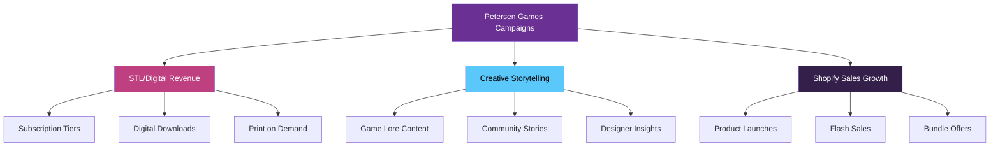

# Petersen Games Campaign Development - Phased Implementation Guide
## Multi-Campaign Strategy with Iterative Learning Approach

**Version**: 1.0 - Comprehensive Campaign Framework  
**Status**: ✅ READY FOR REVIEW  
**Campaigns**: STL/Digital Products | Creative Storytelling | Shopify Sales  
**Integration**: Grid Analytics + Klaviyo + Shopify + Notion

---

## 📚 Phase 1: Learning & Discovery (Days 1-3)

### A. Review Reference Materials
```markdown
Priority Documents to Analyze:
1. ✅ Campaign Case Studies
   - Q4 Digital Product Growth Strategy
   - STL Subscription Models (MyMiniFactory/only-games.co)
   - Revenue projections and conversion metrics

2. ✅ Petersen Games Brand Materials
   - Reference Directory Enhancement Guide
   - Content guides and web copy drafts
   - Tag-based collections implementation

3. ✅ Strategic Planning Documents
   - Campaign planning library
   - Audience segmentation data
   - Platform-specific strategies
```

### B. Key Learnings Extracted
```markdown
Critical Insights:
- 5-6 unique audience segments requiring different content
- STL subscribers expect 2% conversion from 10K list
- Horror gaming authority positioning is crucial
- Multi-platform approach needed (not just social)
- Brand ambassador program essential for UGC
- Social media coordinator needed (part-time minimum)
```

### C. Campaign Architecture Understanding


---

## 🎯 Phase 2: Campaign Design & Segmentation (Days 4-6)

### A. Campaign 1: STL & Digital Product Revenue

#### Audience Segments
```javascript
const stlAudiences = {
  segment1: {
    name: "Professional Painters",
    characteristics: [
      "Skilled miniature painters",
      "Showcase work on Instagram",
      "Value high-detail STLs",
      "Commercial license needs"
    ],
    platforms: ["Instagram", "YouTube", "Discord"],
    contentNeeds: ["Painting tutorials", "Detail shots", "Time-lapses"],
    pricePoint: "$39-79/month"
  },
  
  segment2: {
    name: "3D Printing Enthusiasts",
    characteristics: [
      "Own multiple printers",
      "Active in printing forums",
      "Technical problem solvers",
      "Early adopters"
    ],
    platforms: ["Reddit", "Discord", "YouTube"],
    contentNeeds: ["Print settings", "Support guides", "Size variations"],
    pricePoint: "$19-39/month"
  },
  
  segment3: {
    name: "Game Store Owners",
    characteristics: [
      "Need commercial licenses",
      "Bulk printing for events",
      "Demo game runners",
      "Community leaders"
    ],
    platforms: ["LinkedIn", "Email", "Facebook Groups"],
    contentNeeds: ["Business cases", "ROI data", "Event ideas"],
    pricePoint: "$79/month + bulk deals"
  }
};
```

#### Content Calendar Template
```markdown
Week 1: Launch Preparation
- Monday: Teaser - "Something big for creators"
- Wednesday: Reveal tier structure
- Friday: Early bird special announcement

Week 2: Launch Week
- Monday: Doors open + welcome video
- Tuesday: Member spotlight feature
- Wednesday: Exclusive model preview
- Thursday: Tutorial drop
- Friday: Community challenge

Week 3-4: Momentum Building
- 3x weekly: New model reveals
- 2x weekly: Community features
- 1x weekly: Designer commentary
```

### B. Campaign 2: Creative Storytelling & Game Content

#### Audience Segments
```javascript
const storyAudiences = {
  segment1: {
    name: "Lore Masters",
    characteristics: [
      "Deep game knowledge",
      "Create fan content",
      "Host game nights",
      "Wiki contributors"
    ],
    platforms: ["Discord", "Reddit", "YouTube"],
    contentNeeds: ["Behind-the-scenes", "Designer notes", "Lore deep-dives"],
    engagement: "Very high - daily interaction"
  },
  
  segment2: {
    name: "Casual Horror Fans",
    characteristics: [
      "Love Lovecraft themes",
      "Movie/book crossover",
      "Social media sharers",
      "Meme creators"
    ],
    platforms: ["TikTok", "Instagram", "Twitter/X"],
    contentNeeds: ["Quick facts", "Visual content", "Shareable moments"],
    engagement: "Medium - weekly touchpoints"
  },
  
  segment3: {
    name: "Competitive Players",
    characteristics: [
      "Tournament participants",
      "Strategy guide readers",
      "Rules lawyers",
      "Meta analyzers"
    ],
    platforms: ["Discord", "Forums", "YouTube"],
    contentNeeds: ["Strategy guides", "Tournament reports", "Balance updates"],
    engagement: "High during releases/events"
  }
};
```

### C. Campaign 3: Shopify Sales Acceleration

#### Revenue Stream Matrix
```markdown
| Product Type | Target Audience | Price Point | Campaign Focus |
|--------------|----------------|-------------|----------------|
| Core Games | New Players | $99-149 | Discovery & Education |
| Expansions | Existing Fans | $39-79 | FOMO & Completionism |
| STL Bundles | Digital Natives | $19-99 | Value & Convenience |
| Merchandise | Brand Fans | $15-45 | Community Identity |
| Rulebooks | Collectors | $14.99-29.99 | Premium Content |
```

---

## 🔧 Phase 3: Technical Integration (Days 7-9)

### A. Shopify Analytics → Notion Integration

```javascript
// shopify-notion-connector.js
const ShopifyNotionSync = {
  // Shopify configuration
  shopify: {
    domain: 'petersengames.myshopify.com',
    apiKey: process.env.SHOPIFY_API_KEY,
    apiVersion: '2024-01'
  },
  
  // Analytics to track
  metrics: [
    'total_sales',
    'conversion_rate',
    'average_order_value',
    'cart_abandonment_rate',
    'product_views',
    'customer_lifetime_value'
  ],
  
  // Sync to Notion
  async syncAnalytics() {
    const analytics = await this.fetchShopifyAnalytics();
    const campaigns = await notion.getCampaigns();
    
    // Match sales to campaigns
    for (const campaign of campaigns) {
      const attributedSales = this.attributeSales(
        analytics,
        campaign.startDate,
        campaign.endDate,
        campaign.utmTags
      );
      
      await notion.updateCampaignMetrics(campaign.id, {
        revenue: attributedSales.revenue,
        orders: attributedSales.orderCount,
        aov: attributedSales.averageOrderValue,
        products: attributedSales.topProducts
      });
    }
  }
};
```

### B. Multi-Channel Content Distribution

```javascript
// content-distribution-engine.js
const ContentDistributor = {
  // Master content → Platform variants
  async distributeContent(masterContent) {
    const platforms = {
      instagram: this.adaptForInstagram(masterContent),
      twitter: this.adaptForTwitter(masterContent),
      tiktok: this.adaptForTikTok(masterContent),
      youtube: this.adaptForYouTube(masterContent),
      discord: this.adaptForDiscord(masterContent),
      email: this.adaptForEmail(masterContent)
    };
    
    // Apply brand voice per platform
    for (const [platform, content] of Object.entries(platforms)) {
      content.text = await this.applyPlatformVoice(content.text, platform);
      content.hashtags = this.optimizeHashtags(content.hashtags, platform);
      content.timing = this.calculateOptimalTiming(platform, content.audience);
    }
    
    return platforms;
  }
};
```

### C. Grid Analytics Intelligence Layer

```javascript
// campaign-intelligence.js
const CampaignIntelligence = {
  // Analyze campaign performance
  async analyzeCampaign(campaignId) {
    const performance = await grid.getCampaignMetrics(campaignId);
    
    return {
      // STL Campaign Specific
      subscriptionMetrics: {
        conversionRate: performance.stl_conversion,
        churnRate: performance.stl_churn,
        lifetimeValue: performance.stl_ltv,
        tierDistribution: performance.tier_breakdown
      },
      
      // Content Performance
      contentMetrics: {
        topPerforming: performance.best_content,
        engagementByType: performance.content_type_performance,
        platformWinners: performance.platform_rankings
      },
      
      // Revenue Attribution
      revenueMetrics: {
        directAttribution: performance.direct_sales,
        assistedConversions: performance.assisted_sales,
        channelROI: performance.channel_roi
      },
      
      // AI Recommendations
      recommendations: await this.generateRecommendations(performance)
    };
  }
};
```

---

## 📈 Phase 4: Content Creation & Automation (Days 10-14)

### A. Content Library Structure

```markdown
/content-library/
├── stl-campaign/
│   ├── email-sequences/
│   │   ├── welcome-series/
│   │   ├── tier-upgrade/
│   │   └── re-engagement/
│   ├── social-posts/
│   │   ├── model-reveals/
│   │   ├── printing-tips/
│   │   └── community-features/
│   └── long-form/
│       ├── tutorials/
│       └── case-studies/
│
├── storytelling-campaign/
│   ├── lore-content/
│   │   ├── character-bios/
│   │   ├── world-building/
│   │   └── timeline-events/
│   ├── game-content/
│   │   ├── strategy-guides/
│   │   ├── scenario-ideas/
│   │   └── rule-clarifications/
│   └── community-content/
│       ├── fan-spotlights/
│       ├── tournament-reports/
│       └── creator-interviews/
│
└── shopify-campaign/
    ├── product-launches/
    │   ├── hyperspace/
    │   ├── expansions/
    │   └── limited-editions/
    ├── promotional/
    │   ├── flash-sales/
    │   ├── bundles/
    │   └── seasonal/
    └── educational/
        ├── getting-started/
        ├── gameplay-videos/
        └── unboxing/
```

### B. Batch Content Creation Workflow

```javascript
// batch-content-creator.js
const BatchContentCreator = {
  // Generate week's content in one session
  async createWeeklyContent(campaign, week) {
    const contentPlan = await this.getWeeklyPlan(campaign, week);
    const brandVoice = this.getBrandVoice(campaign.type);
    
    const batchContent = [];
    
    for (const item of contentPlan) {
      const content = await this.generateContent({
        type: item.type,
        platform: item.platform,
        audience: item.targetAudience,
        theme: item.theme,
        brandVoice: brandVoice,
        aiEnhancement: true
      });
      
      // Quality validation
      const quality = await this.validateQuality(content);
      if (quality.score > 0.8) {
        batchContent.push(content);
      } else {
        // Flag for manual review
        content.needsReview = true;
        content.issues = quality.issues;
        batchContent.push(content);
      }
    }
    
    return batchContent;
  }
};
```

### C. Brand Ambassador Program Framework

```javascript
// brand-ambassador-program.js
const AmbassadorProgram = {
  tiers: {
    bronze: {
      requirements: ["3 months active", "5 posts/month"],
      benefits: ["10% discount", "Early access", "Bronze badge"],
      expectedUGC: 5
    },
    silver: {
      requirements: ["6 months active", "10 posts/month", "1 event hosted"],
      benefits: ["15% discount", "Free shipping", "Silver badge", "Exclusive models"],
      expectedUGC: 10
    },
    gold: {
      requirements: ["12 months active", "20 posts/month", "3 events hosted"],
      benefits: ["20% discount", "Free products", "Gold badge", "Co-creation opportunities"],
      expectedUGC: 20
    }
  },
  
  tracking: {
    metrics: ["posts_created", "engagement_generated", "sales_attributed", "events_hosted"],
    rewards: ["points_system", "exclusive_access", "co_creation", "convention_passes"]
  }
};
```

---

## 🚀 Phase 5: Launch & Optimization (Days 15-21)

### A. Launch Sequence

```markdown
Week 1: Soft Launch
- Monday: Team testing & final adjustments
- Tuesday: Brand ambassadors get early access
- Wednesday: VIP email list notification
- Thursday: Social media teasers
- Friday: Full public launch

Week 2: Amplification
- Daily: Content posting per schedule
- Mid-week: First performance review
- End-week: Optimization based on data

Week 3: Scaling
- Increase successful content types
- Pause underperforming channels
- Double down on high-ROI activities
```

### B. Performance Monitoring Dashboard

```javascript
// Real-time Campaign Dashboard Configuration
const DashboardConfig = {
  campaigns: {
    stl: {
      kpis: ["subscribers", "churn_rate", "mrr", "content_engagement"],
      alerts: ["churn > 5%", "mrr_growth < 10%", "engagement < 20%"],
      reports: "weekly"
    },
    storytelling: {
      kpis: ["reach", "engagement", "shares", "ugc_created"],
      alerts: ["engagement < 15%", "ugc < 5_per_week"],
      reports: "daily"
    },
    shopify: {
      kpis: ["revenue", "conversion_rate", "aov", "repeat_rate"],
      alerts: ["conversion < 2%", "aov < $125", "abandonment > 70%"],
      reports: "daily"
    }
  }
};
```

### C. Continuous Optimization Process

```markdown
Daily Tasks:
1. Check dashboard alerts
2. Respond to community engagement
3. Post scheduled content
4. Monitor competitor activity

Weekly Tasks:
1. Performance analysis meeting
2. Content planning for next week
3. A/B test results review
4. Ambassador program check-in
5. Inventory/fulfillment review

Monthly Tasks:
1. Comprehensive campaign review
2. Strategy adjustments
3. New product/content planning
4. Financial reconciliation
5. Team expansion evaluation
```

---

## 👥 Phase 6: Team & Resources (Ongoing)

### A. Recommended Team Structure

```markdown
Immediate Needs:
1. **Social Media Coordinator** (Part-time, 20-30 hrs/week)
   - Platform management
   - Community engagement
   - Content scheduling
   - Basic analytics

2. **Content Creator** (Contract/Part-time)
   - Video editing
   - Graphic design
   - Photography
   - Writing

3. **Community Manager** (Discord focus)
   - Event hosting
   - Moderation
   - Ambassador program
   - Customer support

Future Expansion:
- Influencer Relations Manager
- Data Analyst
- Email Marketing Specialist
```

### B. Budget Allocation

```markdown
Monthly Budget Breakdown:
- Content Creation: 30% ($3,000)
- Team Salaries: 40% ($4,000)
- Tools & Software: 10% ($1,000)
- Ambassador Rewards: 10% ($1,000)
- Contingency: 10% ($1,000)

Total: $10,000/month

Expected ROI: 300%+ within 6 months
```

---

## 📊 Success Metrics & KPIs

### Campaign-Specific Targets

```markdown
STL Campaign (6 months):
- Subscribers: 0 → 500
- MRR: $0 → $15,000
- Churn: < 5%
- Content pieces: 200+

Storytelling Campaign:
- Followers: +10,000 total
- Engagement rate: 25%+
- UGC pieces: 50/month
- Community events: 2/month

Shopify Sales:
- Revenue increase: 40%
- AOV: $125 → $150
- Repeat rate: 20% → 35%
- Email list: 10K → 15K
```

---

## 🎯 Implementation Checklist

### Pre-Launch (Complete these first)
- [ ] Review all reference materials thoroughly
- [ ] Set up Notion databases from deployment scripts
- [ ] Configure Klaviyo email automation
- [ ] Connect Grid analytics
- [ ] Design Shopify-Notion integration
- [ ] Create content templates
- [ ] Recruit social media coordinator
- [ ] Set up brand ambassador program structure

### Launch Phase
- [ ] Activate campaigns in sequence (STL → Story → Shopify)
- [ ] Monitor daily dashboards
- [ ] Engage with early adopters
- [ ] Collect feedback actively
- [ ] Iterate based on data

### Post-Launch
- [ ] Weekly optimization meetings
- [ ] Monthly strategy reviews
- [ ] Quarterly major pivots if needed
- [ ] Annual comprehensive audit

---

## 📝 Key Recommendations

1. **Start with STL Campaign** - Highest ROI potential and clearest metrics
2. **Hire Social Media Coordinator ASAP** - Critical for consistent execution
3. **Focus on Discord** - Highest engagement platform for your audience
4. **Implement Shopify Analytics** - Revenue attribution is crucial
5. **Launch Ambassador Program Early** - UGC is your best content source
6. **Test and Iterate Quickly** - Don't wait for perfection

---

**Ready for Implementation?** This guide provides the complete framework for your multi-campaign strategy. Each phase builds on the previous, allowing for learning and optimization throughout the process.

*Questions? Contact support@9bitstudios.io*