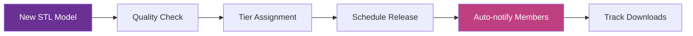

# Portal User Guide Update - Petersen Games Enhanced
## Quick-Start Sections & Workflows

**Version**: 2.0 - Petersen Games Campaign Ready  
**Status**: ✅ IMPLEMENTATION READY  
**Integration**: Klaviyo + Grid + Apple Intelligence

---

## 🚀 Quick-Start: Campaign Creation

### 1-Minute Campaign Launch
```markdown
1. Navigate to Petersen Games Hub > Campaign Command Center
2. Click "New Campaign" button (or use Siri: "Create new Petersen campaign")
3. Select campaign type:
   - Product Launch (e.g., Hyperspace)
   - STL Membership Drive
   - Seasonal Promotion
   - Brand Awareness
4. AI fills template based on selection
5. Review & Launch
```

### Campaign Creation Checklist
- [ ] Campaign objective defined
- [ ] Target platforms selected (X, FB, IG, YouTube, TikTok, Discord)
- [ ] Content calendar populated
- [ ] Brand voice validated (Horror Gaming Authority)
- [ ] Klaviyo email sequence connected
- [ ] Analytics tracking enabled

---

## 🎮 Petersen Games Specific Workflows

### A. STL Membership Management

#### Quick Setup (3 Steps)
```markdown
1. STL Dashboard > New Membership Tier
2. Configure:
   - Tier Name (Bronze/Silver/Gold/Platinum)
   - Monthly Price
   - Benefits (auto-populated based on tier)
   - Exclusive Models
3. Auto-generates:
   - Welcome email sequence
   - Member portal access
   - Discord role assignment
   - Content release schedule
```

#### Membership Benefits Matrix
| Tier | Price | Models/Month | Early Access | Discount | Exclusive Content |
|------|-------|--------------|--------------|----------|-------------------|
| Bronze | $9.99 | 3 | 24 hours | 10% | Basic models |
| Silver | $19.99 | 5 | 48 hours | 15% | + Alternate poses |
| Gold | $39.99 | 10 | 72 hours | 20% | + Terrain pieces |
| Platinum | $79.99 | 20 | 1 week | 25% | + Campaign modules |

#### Content Release Workflow


### B. Multi-Platform Content Distribution

#### Platform-Specific Templates
```markdown
X (Twitter):
- Character: 280 chars
- Image: 1200x675px optimal
- Video: 2:20 max
- Thread capability

Facebook:
- Character: No limit (keep <500)
- Image: 1200x630px
- Video: 240 min max
- Event creation

Instagram:
- Feed: 1080x1080px
- Stories: 1080x1920px
- Reels: 9:16 ratio
- 30 hashtag limit

YouTube:
- Thumbnail: 1280x720px
- Description: 5000 chars
- Tags: 500 chars total
- End screens

TikTok:
- Video: 9:16 ratio
- Duration: 10 min max
- Trending sounds
- Effect integration

Discord:
- Announcement channels
- Role-based access
- Event scheduling
- Voice channel events
```

#### Content Adaptation Workflow
1. **Create Master Content** in Content Library
2. **AI Adapts** for each platform automatically
3. **Review & Tweak** platform-specific versions
4. **Schedule** across all platforms
5. **Monitor** unified analytics

### C. Revenue Tracking Dashboard

#### Digital Product Categories
```markdown
1. STL Files
   - Individual models ($5-25)
   - Bundle packs ($30-100)
   - Subscription tiers ($9.99-79.99/mo)

2. Print-on-Demand
   - Posters ($15-40)
   - Apparel ($25-60)
   - Accessories ($10-30)

3. Digital Downloads
   - Screensavers ($2.99)
   - Wallpaper packs ($4.99)
   - Digital art books ($9.99-19.99)

4. Digital Rulebooks
   - PDF rulebooks ($14.99-29.99)
   - Enhanced editions ($39.99)
   - Bundle deals ($59.99+)
```

---

## 🔌 Latest API Endpoints

### Klaviyo Integration (Live)
```javascript
// Brand-aware email automation
const klaviyoEndpoints = {
  lists: 'https://a.klaviyo.com/api/lists/',
  campaigns: 'https://a.klaviyo.com/api/campaigns/',
  templates: 'https://a.klaviyo.com/api/templates/',
  metrics: 'https://a.klaviyo.com/api/metrics/'
};

// Headers
headers: {
  'Authorization': `Klaviyo-API-Key ${KLAVIYO_PRIVATE_KEY}`,
  'revision': '2024-10-15'
}
```

### Grid Analytics (Active)
```javascript
// Content performance analysis
const gridEndpoints = {
  analyze: '/api/content/analyze',
  optimize: '/api/content/optimize',
  report: '/api/analytics/report',
  insights: '/api/strategic/insights'
};

// Integration with campaign dashboard
gridAnalytics.trackCampaign(campaignId);
```

### Notion API (Updated)
```javascript
// Latest database IDs
const notionDatabases = {
  campaigns: '217df58779188173a14ad8c5b8cb3803', // Petersen Games Hub
  content: '217df587791881fda83bcf2d0b03681d',   // Content Calendar
  stl: '217df587791881238aa2d97af14a8e3d',       // STL Membership
  analytics: '217df587791881fda83bcf2d0b03681d'  // Analytics Hub
};
```

---

## 🛠️ Troubleshooting Common Issues

### Issue: Campaign Not Syncing to Klaviyo
```markdown
Solution:
1. Check API key in Settings > Integrations
2. Verify email list exists in Klaviyo
3. Ensure campaign has email component
4. Check webhook logs for errors

Quick Fix: Resync button in campaign settings
```

### Issue: STL Download Links Not Working
```markdown
Solution:
1. Verify file upload completed
2. Check member tier permissions
3. Confirm payment status
4. Test download link manually

Quick Fix: Regenerate download links
```

### Issue: Multi-Platform Posting Delays
```markdown
Solution:
1. Check platform API limits
2. Verify authentication tokens
3. Review scheduling queue
4. Check timezone settings

Quick Fix: Stagger posts by 5 minutes
```

### Issue: Analytics Not Updating
```markdown
Solution:
1. Verify Grid API connection
2. Check data sync schedule
3. Clear analytics cache
4. Manually trigger sync

Quick Fix: Force refresh analytics
```

---

## 🎯 Best Practices

### Campaign Planning
1. **Start with Objectives**: Define clear KPIs before creating
2. **Use Templates**: Leverage AI-suggested templates
3. **Test Small**: Run pilot campaigns before full launch
4. **Monitor Daily**: Check dashboard for first 3 days

### Content Creation
1. **Batch Create**: Use AI to generate week's content at once
2. **Maintain Voice**: Always validate brand consistency
3. **Visual First**: Gaming audience responds to visuals
4. **Engagement Focus**: Ask questions, create polls

### STL Management
1. **Regular Releases**: Consistent schedule builds anticipation
2. **Exclusive Content**: Reserve best models for higher tiers
3. **Community Input**: Poll members on desired models
4. **Quality Control**: Test print all models before release

---

## 🚨 Quick Actions Menu

### Keyboard Shortcuts
- `Cmd/Ctrl + N` → New Campaign
- `Cmd/Ctrl + K` → Quick Search
- `Cmd/Ctrl + D` → Duplicate Item
- `Cmd/Ctrl + /` → Show Commands

### Siri Commands (When Enabled)
- "Show Petersen campaign performance"
- "Create new STL release"
- "Schedule social media posts"
- "Generate campaign report"

### One-Click Actions
- **Emergency Pause**: Stop all campaigns instantly
- **Bulk Schedule**: Set week's content in one action
- **Report Generator**: Instant PDF reports
- **Template Library**: Access all templates

---

## 📚 Additional Resources

### Training Videos
1. [Campaign Creation Walkthrough](#)
2. [STL Membership Setup](#)
3. [Multi-Platform Management](#)
4. [Analytics Deep Dive](#)

### Support Channels
- **Help Center**: help.9bitstudios.io
- **Discord**: 9Bit Studios Community
- **Email**: support@9bitstudios.io
- **Live Chat**: Bottom-right corner

### Certification Program
- **Basic**: Portal Navigation (1 hour)
- **Advanced**: Campaign Management (3 hours)
- **Expert**: Full Platform Mastery (8 hours)

---

**Next Step**: Review the [Campaign Templates Library](campaign-templates.md) for ready-to-use campaigns

*Last Updated: 2025-06-25 | Version 2.0*