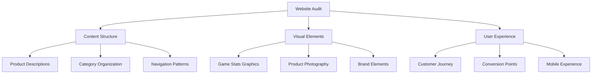

# Petersen Games Reference Directory Enhancement Guide

Project Status: Not Started
Created time: June 9, 2025 5:15 PM
Last edited time: June 9, 2025 5:40 PM

## 📂 Enhanced Reference Directory Structure

```
/clients/petersen-games/content-reference/
├── website-content-analysis/
│   ├── current-site-audit/
│   │   ├── petersengames-homepage.md
│   │   ├── about-us-analysis.md
│   │   ├── product-pages-structure.md
│   │   └── visual-elements-inventory.md
│   ├── game-line-deep-dive/
│   │   ├── cthulhu-wars-complete.md
│   │   ├── planet-apocalypse-assets.md
│   │   ├── hyperspace-launch-prep.md
│   │   ├── evil-high-priest-optimization.md
│   │   └── orcs-must-die-overview.md
│   └── competitive-analysis/
│       ├── similar-brands-study.md
│       └── shopify-best-practices.md
├── brand-assets-optimized/
│   ├── game-stats-graphics/
│   ├── product-photography/
│   ├── logo-variations/
│   └── packaging-elements/
├── content-intelligence-analysis/
│   ├── grid-analysis-reports/
│   ├── oksana-creator-portal-data/
│   └── strategic-recommendations/
└── implementation-guides/
    ├── database-optimization-plan.md
    ├── theme-customization-roadmap.md
    └── launch-sequence-checklist.md
```

## 🎯 Apple Intelligence Director Prompts for Content Analysis

### Prompt 1: Website Content Audit & Analysis

```
Apple Intelligence Product Director: Conduct comprehensive content audit of Petersen Games website.

PRIMARY SOURCES:
- https://petersengames.com (main website)
- https://petersengames.com/about-us/
- https://shop.petersengames.com (current Shopify)

GAME LINES TO ANALYZE:
- Cthulhu Wars: https://petersengames.com/cthulhu-wars/
- Planet Apocalypse: https://petersengames.com/planet-apocalypse/
- Hyperspace: https://petersengames.com/hyperspace/
- Evil High Priest: https://petersengames.com/evil-high-priest/
- Orcs Must Die: https://petersengames.com/orcs-must-die/

ANALYSIS FOCUS:
1. Content structure and information hierarchy
2. Visual design patterns and brand elements
3. Product presentation strategies
4. Game stats graphics implementation
5. Image galleries and carousel usage
6. Category organization methods
7. SEO optimization opportunities

OUTPUT: Structured analysis document with actionable insights for Shopify optimization
REFERENCE: /clients/petersen_games/reference/CSS-style-reference for brand consistency
```

### Prompt 2: Game Line Content Enhancement Strategy

```
Apple Intelligence Product Director: Create enhanced content strategy for priority game lines.

CONTEXT: Current Shopify database has minimal product information
OBJECTIVE: Optimize 5 priority game lines for maximum conversion

PRIORITY GAMES:
1. Cthulhu Wars (flagship/most expensive)
2. Planet Apocalypse (luxury/sophisticated)
3. Hyperspace (new launch - 4 weeks)
4. Evil High Priest (underexposed potential)
5. Orcs Must Die (established line)

CONTENT REQUIREMENTS:
- Enhanced product descriptions with emotional hooks
- Game stats graphics integration
- "What's in the box" imagery strategy
- Category optimization for discoverability
- SEO-optimized metadata
- Cross-selling opportunities between products

SPECIAL FOCUS:
- Hyperspace launch page creation
- Miniatures category architecture
- STL integration touchpoints

OUTPUT: Content enhancement specifications for each game line
VALIDATION: Against current website content and brand voice
```

### Prompt 3: Grid Integration for Strategic Analysis

```
Apple Intelligence Product Director: Leverage Grid Integration for Petersen Games strategic analysis.

NOTION DATA SOURCES:
- Oksana Creator Portal Accelerator Root: 203df587791880018244e27988010716
- Projects Database: 203df5877918803ba4ccd36e90d12c81

EXISTING STRATEGIC CONTEXT:
- Strategic Partnership Framework: Legacy Games × 9Bit Studios
- Strategic Pivot: Petersen Games Partnership & iOS Game Focus
- Revenue Reality Check: Three Paths to $10K

GRID ANALYSIS OBJECTIVES:
1. Analyze historical campaign performance data
2. Identify content optimization opportunities
3. Generate strategic recommendations for Shopify enhancement
4. Cross-reference campaign case studies with current needs
5. Optimize resource allocation for maximum impact

SHOPIFY DATABASE CONTEXT:
- Original Database (locked): 9d0b4f50848a4936ac52e76fc3b791c5
- Working Database: 208df587791880a89326dd7658a9a9f3
- Extended Analytics: bf2a545baa7b4b9c87bb7b9c8e62d264

OUTPUT: Strategic optimization plan with Grid-calculated priorities
INTEGRATION: Combine Oksana Creator Portal Accelerator insights with Shopify optimization strategy
```

## 🔍 Content Analysis Framework

### Website Content Extraction Strategy

### Current Website Analysis Points



### Key Content Elements to Extract

1. **Product Information Architecture**
    - Current description patterns
    - Pricing structures
    - Category hierarchies
    - Cross-reference systems
2. **Visual Asset Inventory**
    - Game stats graphics (standardized for
    mat)
    - Product photography styles
    - Packaging visual elements
    - In-box content imagery
3. **Brand Voice Patterns**
    - Tone and messaging consistency
    - Technical vs. accessible language balance
    - Call-to-action effectiveness
    - Customer communication style

### Game Line Deep Dive Specifications

### Cthulhu Wars Analysis

```
Apple Intelligence Product Director: Extract comprehensive Cthulhu Wars content for Shopify optimization.

SOURCE: https://petersengames.com/cthulhu-wars/
FOCUS: Flagship product presentation strategy

EXTRACT:
- Product line hierarchy and variants
- Pricing strategy and positioning
- Visual presentation methods
- Game complexity communication
- Expansion integration approach
- Community/cult appeal elements

OPTIMIZE FOR:
- Premium positioning maintenance
- Complex product line simplification
- Conversion optimization for high-value items
- Cross-selling expansion opportunities
```

### Planet Apocalypse Luxury Positioning

```
Apple Intelligence Product Director: Analyze Planet Apocalypse luxury presentation.

SOURCE: https://petersengames.com/planet-apocalypse/
KICKSTARTER: https://www.kickstarter.com/projects/petersengames/planet-apocalypse
CONTEXT: Sophisticated art aesthetic, campaign created by client

EXTRACT:
- Luxury positioning strategies
- Visual storytelling approaches
- Premium packaging presentation
- Art direction consistency
- Campaign messaging effectiveness

OPTIMIZE FOR:
- Luxury market positioning
- Visual impact maximization
- Art-focused customer attraction
- Premium price point justification
```

### Hyperspace Launch Preparation

```
Apple Intelligence Product Director: Create Hyperspace launch content strategy.

SOURCE: https://petersengames.com/hyperspace/
TIMELINE: 4 weeks to availability
STATUS: New product launch

DEVELOP:
- Pre-launch landing page content
- Anticipation building messaging
- Product positioning strategy
- Launch sequence planning
- Early adopter targeting

INTEGRATE:
- Coming soon campaign elements
- Email capture optimization
- Social media launch assets
- Shopify staging for immediate activation
```

## 📊 Grid Integration Analysis Framework

### Oksana Creator Portal Accelerator Data Utilization

### Strategic Context Analysis

```
Grid Analysis Integration: Process Petersen Games strategic context for optimization insights.

DATA SOURCES:
- Historical campaign case studies (3 iterations)
- Partnership framework documentation
- Revenue analysis and projections
- STL monetization strategies

ANALYSIS OBJECTIVES:
1. Identify highest-impact optimization opportunities
2. Calculate resource allocation efficiency
3. Predict conversion optimization potential
4. Generate data-driven content recommendations

OUTPUT: Strategic priority matrix for Shopify enhancement
```

### Campaign Intelligence Application

```
Grid Analysis Integration: Apply campaign case study insights to Shopify optimization.

REFERENCE: /clients/petersen_games/reference/campaign planning/campaign-case-studies/
CONTEXT: 3 STL subscription iterations with monetization strategies

CALCULATE:
- Content optimization ROI potential
- Customer acquisition cost projections
- Conversion rate improvement estimates
- Resource allocation efficiency

RECOMMEND:
- Priority content development areas
- Optimization sequence planning
- Budget allocation strategies
- Timeline optimization
```

## 🎨 Visual Asset Enhancement Strategy

### Game Stats Graphics Integration

```
Apple Intelligence Product Director: Standardize game stats graphics for Shopify implementation.

CURRENT IMPLEMENTATION: Featured on petersengames.com packaging
OBJECTIVE: Database integration as searchable properties and visual elements

REQUIREMENTS:
1. Extract existing game stats format
2. Create standardized template
3. Implement as Shopify metafields
4. Design visual display system
5. Optimize for mobile presentation

INTEGRATION:
- Product page visual enhancement
- Category filtering capabilities
- Search functionality improvement
- Cross-product comparison features
```

### Product Photography Optimization

```
Apple Intelligence Product Director: Enhance product photography strategy.

CURRENT STATE: Single image per product in Shopify
OBJECTIVE: Multi-image galleries with "what's in the box" context

REQUIREMENTS:
1. Inventory existing product photography
2. Identify "what's in the box" content needs
3. Create photography priority list
4. Design gallery presentation system
5. Optimize for conversion impact

PRIORITY FOCUS:
- Core 5 game lines immediate enhancement
- Miniatures category visual strategy
- Cross-selling visual connections
- Mobile-optimized presentation
```

## 🔄 Implementation Integration Guide

### Database Enhancement Workflow

```
Apple Intelligence Product Director: Create database enhancement workflow.

SOURCE DATABASE: Shopify Products Duplicate (208df587791880a89326dd7658a9a9f3)
REFERENCE: Extended Google Sheets DB (bf2a545baa7b4b9c87bb7b9c8e62d264)

ENHANCEMENT SEQUENCE:
1. Content audit and gap analysis
2. Priority product identification
3. Enhanced description development
4. Visual asset integration
5. Category optimization
6. SEO metadata enhancement
7. Cross-selling setup

VALIDATION:
- Against current website content
- Brand voice consistency check
- Technical implementation feasibility
- Conversion optimization potential
```

### STL Integration Touchpoints

```
Apple Intelligence Product Director: Identify STL monetization integration opportunities.

STRATEGY: Free STL opt-ins for membership building
CANDIDATES: Monsters from Cthulhu Wars and Planet Apocalypse

INTEGRATION POINTS:
1. Product page STL mentions
2. Category page promotional elements
3. Email capture optimization
4. Cross-selling to STL membership
5. Social proof integration

PLATFORMS:
- My Mini Factory membership strategy
- Patreon integration planning
- Something Games catalog preparation
- Shopify to external platform linking
```

## 📋 Implementation Checklist

### Phase 1: Content Extraction & Analysis

- [ ]  Complete website content audit
- [ ]  Extract game stats graphics standards
- [ ]  Inventory existing visual assets
- [ ]  Analyze brand voice patterns
- [ ]  Document current user experience flow

### Phase 2: Strategic Analysis Integration

- [ ]  Process Oksana Creator Portal Accelerator strategic data
- [ ]  Apply Grid analysis to optimization priorities
- [ ]  Calculate ROI potential for enhancements
- [ ]  Generate data-driven recommendations
- [ ]  Create implementation priority matrix

### Phase 3: Content Enhancement Development

- [ ]  Enhanced descriptions for priority game lines
- [ ]  Game stats graphics integration design
- [ ]  Visual asset enhancement plan
- [ ]  Category optimization strategy
- [ ]  SEO metadata development

### Phase 4: Shopify Integration Preparation

- [ ]  Database enhancement specifications
- [ ]  Theme customization requirements
- [ ]  Visual asset integration plan
- [ ]  STL touchpoint integration
- [ ]  Launch sequence preparation

This guide provides your Apple Intelligence Product Director with comprehensive direction for enhancing the reference directory while leveraging both existing published content and strategic insights from the Oksana Creator Portal Accelerator integration.